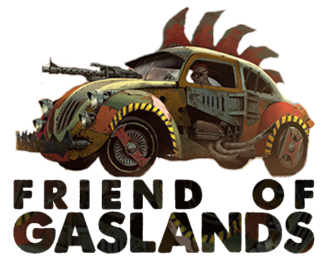

# Gaslands Garage



Gaslands Garage is a web application for creating, validating, and sharing vehicle teams for the Gaslands tabletop game. This tool helps players design and manage their teams with ease, offering a comprehensive rules-based validation system.

**Live Website**: [https://www.GaslandsGarage.com](https://www.GaslandsGarage.com)

[](https://creativecommons.org/licenses/by-nc/4.0/)

## 🔥 Features

- **Team Building**: Create complete Gaslands teams with any combination of vehicles, weapons, upgrades, and perks
- **Sponsor Support**: All official sponsors with their unique perks and abilities
- **Rules Validation**: Automatic validation ensures your team follows the official Gaslands rules
- **Team Sharing**: Generate QR codes and shareable links to exchange team builds
- **Team Management**: Save and load your team builds with user accounts
- **Print Functionality**: Print vehicle cards for your games with different formats
- **Dark Mode**: Eye-friendly dark mode support

## 🏎️ About Gaslands

Gaslands is a tabletop game of post-apocalyptic vehicular combat created by Mike Hutchinson and published by Osprey Games. Using converted Hot Wheels or Matchbox cars, it simulates a televised bloodsport where drivers compete in a variety of deadly scenarios.

This application is created under the Friends of Gaslands program. Gaslands is © 2017 Mike Hutchinson.

## 🧰 Development

### Prerequisites

To develop Gaslands Garage, you'll need:

- [Node.js](https://nodejs.org/) (v16 or newer)
- [pnpm](https://pnpm.io/) for package management
- A modern web browser (Chrome, Firefox, Edge, or Safari)
- Basic understanding of TypeScript, Svelte, and web development

### Repository Structure

- `/app`: Svelte-based web application frontend
  - `/src/data/rules`: Game rule definitions (vehicles, weapons, perks, sponsors)
  - `/src/lib/draft`: Functions for encoding/decoding team builds
  - `/src/lib/rules`: Types and loaders for game rules
  - `/src/lib/validate`: Validation logic for team builds
  - `/src/routes`: Svelte routes and components
- `/infra`: AWS CDK infrastructure for deployment
- `/validate`: Core validation logic (shared)

### Getting Started

1. Clone the repository:
   ```bash
   git clone https://github.com/joseanes/gaslands-garage.git
   cd gaslands-garage
   ```

2. Install dependencies:
   ```bash
   pnpm install
   ```

3. Start the development server:
   ```bash
   cd app
   pnpm dev
   ```

4. Open your browser and navigate to `http://localhost:5173`

### Development Commands

```bash
# Start the development server with browser open
cd app && pnpm dev -- --open

# Type checking
cd app && pnpm check

# Watch mode type checking
cd app && pnpm check:watch

# Run tests
cd app && pnpm test

# Run tests in watch mode
cd app && pnpm test:watch

# Run tests with coverage
cd app && pnpm test:coverage
```

### Building for Production

```bash
# Build the application
cd app && pnpm build

# Preview the production build
cd app && pnpm preview
```

### Firebase Deployment

```bash
# Deploy Firestore security rules
cd app && node deploy-firebase-rules.mjs

# Or using Firebase CLI directly:
firebase deploy --only firestore:rules --project=gaslandsgarage-74ce6
```

### Infrastructure Deployment (AWS)

```bash
# Build the infrastructure
cd infra && pnpm build

# Deploy the infrastructure to AWS
cd infra && npx cdk deploy

# Compare deployed stack with current state
cd infra && npx cdk diff
```

## 🛠️ Technology Stack

- **Frontend**: [Svelte](https://svelte.dev) and [SvelteKit](https://kit.svelte.dev)
- **Styling**: [Tailwind CSS](https://tailwindcss.com)
- **Validation**: [Zod](https://github.com/colinhacks/zod) for type validation
- **Testing**: [Vitest](https://vitest.dev/) for unit testing
- **Infrastructure**: [AWS CDK](https://aws.amazon.com/cdk/) for deployment
- **Data Storage**: [Firebase](https://firebase.google.com) for user data and teams (Project: gaslandsgarage-74ce6)
- **Authentication**: Firebase Authentication

## 🔑 Key Components

- **Rules Data**: JSON files define game rules (vehicles.json, weapons.json, perks.json, vehicleRules.json, sponsor/*.json)
- **Validation Logic**: Functions to validate team builds against game rules
- **Draft Encoding**: Functions to encode/decode team builds for sharing (via URLs or QR codes)
- **Builder UI**: Svelte components for the team builder interface
- **Print Service**: Multiple print formats (Vehicle Cards, Roster, Dashboard) for physical game reference
- **Coach Component**: AI-powered team analysis providing combat effectiveness metrics and optimization suggestions

## 📜 License

This work is licensed under a [Creative Commons Attribution-NonCommercial 4.0 International License](https://creativecommons.org/licenses/by-nc/4.0/). You are free to share and adapt this work for non-commercial purposes, provided you give appropriate credit.

## 👥 Contributors

- José Anes, Project creator and [Gaslands Purveyor at FunBoardGames](https://FunBoardGames.Etsy.com)
- Luca Vince Caltabiano from [Gaslands TV](https://www.youtube.com/c/gaslandstv) for video content

## 🔗 Useful Links

- [Official Gaslands Website](https://gaslands.com)
- [Fun Board Games Etsy Shop](https://funboardgames.etsy.com/)
- [Gaslands TV YouTube Channel](https://www.youtube.com/c/gaslandstv)

## 📐 Software Architecture

### Core Architecture Principles

Gaslands Garage follows a component-based architecture with a clear separation of concerns:

1. **Rules System**: The core ruleset is defined in static JSON files and validated using Zod schemas
2. **State Management**: All team state is managed in the main builder page with reactive updates
3. **Validation Engine**: A dedicated validator ensures team builds follow Gaslands rules
4. **Team Serialization**: Draft encoding/decoding system for sharing teams via URLs and QR codes

### Data Flow

1. **User Actions**: The user selects sponsors, vehicles, weapons, and upgrades in the Svelte UI
2. **State Updates**: These changes update the reactive state in the builder page component
3. **Validation**: The validation engine continuously validates the team against the game rules
4. **Cost Calculation**: The `calculateTotalCansDirectly` function computes the total cost of all vehicles and components
5. **Metrics**: The Coach component analyzes team composition for combat effectiveness, survivability, etc.

### Key Component Interactions

- **Builder Page (`/routes/builder/+page.svelte`)**: Central component managing team state and UI
- **Team Loading (`importDraftFn`)**: Handles importing teams from various sources (URL, string, or saved teams)
- **Validation (`validateDraft` in `/lib/validate/index.ts`)**: Validates teams against game rules
- **Coach Component**: Analyzes team metrics and provides optimization suggestions
- **Print Service**: Handles different print styles and formats for physical reference cards

### Code Structure

- **Data Models**: Defined in `/lib/rules/types.ts` using Zod schemas
- **Rule Loaders**: Functions in `/lib/rules/loadRules.ts` load and parse game data
- **Validation Logic**: Split between calculation (`calc.ts`) and rule checks (`checks.ts`)
- **Team Import/Export**: Encoding/decoding in `/lib/draft/io.ts`
- **Services**: Firebase integration for user authentication and team storage

### Troubleshooting Guide

#### Common Issues

1. **Missing totalCans Calculation**: When loading a team, ensure `calculateTotalCansDirectly()` is called
2. **Validation Errors**: The validator may block invalid components; check the console for detailed messages
3. **Weapon Instance IDs**: Weapons use an `originalId_instanceId` format that needs special parsing

#### Reactive Update Debugging

The application uses Svelte's reactive system. Key reactive statements:
- `$: totalCans = calculateTotalCansDirectly();` recalculates costs when dependencies change
- `$: if (sponsorId && sponsorId !== lastSponsorId) {...}` handles sponsor-specific validation

When updating the codebase, ensure recalculation happens at all entry points where teams are loaded or modified.